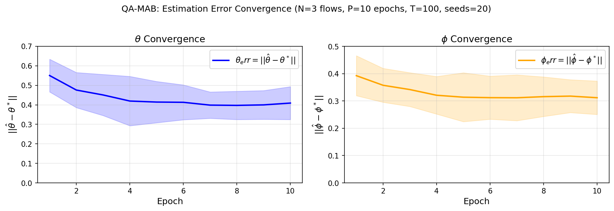
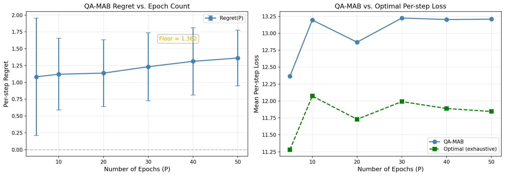

# QA-MAB in Dynamic UAV Environment — Full Research Document

**Date:** 2026-05-03
**Status:** Iteration 1 Complete

---

## 1. The Static Environment Problem

### 1.1 What We Tried First

We started with a **static** multi-agent routing environment (Clean Split, N=10 agents, M=4 routes).

The approach:
- **Phase A:** Oracle interference `I` known → QUBO works perfectly → SW ratio = **0.1309** (+49% over baselines) ✓
- **Phase B:** Learned interference `Î` → catastrophic failure → SW ratio = **0.0144** ✗

### 1.2 Why Phase B Failed: The Identifiability Loop

The problem was a **circular dependency** between `B̂` (bandwidth estimate) and `Î` (interference estimate):

```
Î is wrong → B̂_observed is wrong → QUBO makes bad decisions →
no collision signals → Î can't learn → Î stays wrong → B̂ stays wrong
```

This is the **identifiability problem**: from the aggregate SW signal alone, there's no way to decompose it into individual agent contributions without knowing the interference structure first — which requires the decomposition to already be correct.

**Conclusion:** In a static environment, the identifiability loop cannot be broken. Phase B will never match Phase A.

---

## 2. The Shift to Dynamic Environment

### 2.1 The Insight

Yonathan proposed: **switch to a dynamic piecewise-stationary environment.** The intuition:

- In a static environment, once the algorithm picks a bad solution, it gets stuck
- In a dynamic environment, the topology changes every epoch → more exploration signal
- The algorithm must learn continuously → the identifiability problem matters less

### 2.2 The Environment

At each **epoch** `p`:
1. UAVs receive new random positions → new topology
2. New `N=3` source-destination flows are generated
3. For `T=100` steps, each agent selects one of `K=4` candidate paths
4. The environment returns loss and collision feedback

The **ground truth is constant** (`θ*`, `φ*`) but hidden. Only the **topology** changes.

**Key difference from static:** New flows force the algorithm to route through different parts of the network, exploring all zones and learning fault rates across the whole map — not just the static subset of routes.

---

## 3. The QA-MAB Algorithm

### 3.1 Overview

At each step `t` within epoch `p`:

1. **Build QUBO** — encode current estimates + constraints into an `N×K` QUBO matrix
2. **SA solver** — find near-optimal path selection via Simulated Annealing
3. **Execute** — routes are chosen, environment returns losses
4. **Learn** — update `θ̂` and `φ̂` via residual credit assignment

`θ̂` and `φ̂` **persist across epochs** (unlike NB3R which resets), enabling transfer learning.

### 3.2 Memory (State)

```
θ̂ ∈ [0,1]^m          — estimated failure rate per UAV
φ̂ ∈ [0,1]^Z          — estimated interference rate per zone
visit_counts[N,K]     — how many times each path was chosen (UCB)
```

All initialized to zero. Ground truth is: 4 faulty UAVs with θ*∈[0.2,0.4], 2 faulty zones with φ*∈[0.2,0.4].

### 3.3 The QUBO Matrix

**Variable encoding:** `x[n·K + k] = 1` ⟺ flow `n` takes path `k`.

**Energy function:** `E(x) = x^T Q x`

#### Diagonal — Linear Cost

```
Q[n·K+k, n·K+k] = (Σ_{i∈path(n,k)} θ̂[i] + Σ_{z∈path(n,k)} φ̂[z]) − λ
```

- `λ = 10.0` (one-hot penalty — encourages selecting a path)
- Lower diagonal = cheaper path = more likely to be chosen

#### UCB Exploration Bonus (v2)

```
Q[n·K+k, n·K+k] -= ucb_c / √(visits[n,k])
```

Where `ucb_c = 3.0`. Rarely-visited paths get a larger bonus → exploration without a separate mechanism.

#### Off-Diagonal — Same-Flow (One-Hot Constraint)

For paths `k < k'` of the same flow `n`:
```
Q[n·K+k, n·K+k'] += λ
Q[n·K+k', n·K+k] += λ
```
Energy = `2λ` if two paths selected for one flow → SA avoids this.

#### Off-Diagonal — Cross-Flow Interactions

**Collision penalty** (if paths share any UAV):
```
Q[n·K+k, l·K+j] += C_coll   (C_coll = 5.0)
Q[l·K+j, n·K+k] += C_coll
```

**Proximity interference** (paths that pass close in space):
```
Q[n·K+k, l·K+j] += exp(−d / d0)   (d0 = 150.0)
Q[l·K+j, n·K+k] += exp(−d / d0)
```
Where `d` = minimum pairwise Euclidean distance between any two UAVs on the two paths.

### 3.4 Simulated Annealing

Temperature schedule:
```
γ(p,t) = γ₀ / ((p+1)^a · (t+1)^b)
```
With `γ₀=2.0, a=0.5, b=0.3`. High temperature early = exploration. Near-zero late = pure minimization.

SA runs with `n_reads=20, n_sweeps=200, T_init=2.0, T_final=0.05`.

### 3.5 Learning — Residual Credit Assignment (Fix A)

After the SA selects paths and the environment returns losses `L[n]`:

**Step 1: Subtract structural penalties**
```
collision_count[n] = # other flows sharing ≥1 UAV with flow n
prox_interference[n] = Σ_{j≠n} exp(−d / d0)
L_fault[n] = L[n] − C_coll · collision_count[n] − prox_interference[n]
```
This removes the deterministic parts of the loss, leaving `≈ Σ θ*[i] + Σ φ*[z] + noise`.

**Step 2: Residual credit assignment**
For each UAV `i` on flow `n`'s path:
```
other_theta = Σ_{j≠i} θ̂[j]   (sum of OTHER UAVs on same path)
residual_i  = L_fault[n] − other_theta − φ̂_contribution
θ̂[i] ← θ̂[i] + α · (residual_i − θ̂[i])
```
Each UAV learns only its **marginal contribution** — not the total path loss. This prevents healthy UAVs from being biased upward (the critical bug that was fixed).

**Step 3: Epoch decay (Fix B)**
At the start of each epoch:
```
θ̂ ← θ̂ × 0.7
φ̂ ← φ̂ × 0.7
```
This forgets stale path correlations from the previous topology while preserving the underlying fault knowledge.

### 3.6 Complete Algorithm Pseudocode

```
initialize θ̂ = 0, φ̂ = 0
for epoch p = 1 to P:
    sample new topology (UAV positions, flows)
    θ̂ *= 0.7, φ̂ *= 0.7    (decay)
    visit_counts = 0

    for step t = 1 to T:
        for each flow n:
            scores[n,k] = Σθ̂[i] + Σφ̂[z] − λ − ucb_c/√(visits[n,k])
        QUBO = build_matrix(scores, collision_terms, interference_terms)
        Q_scaled = QUBO / γ(p,t)
        paths = SA_solve(Q_scaled)
        losses = environment(paths)

        for each flow n:
            for each UAV i in path[n]:
                residual = L_fault[n] − Σ_{j≠i} θ̂[j] − φ̂_contribution
                θ̂[i] += α · (residual − θ̂[i])
            for each zone z in path[n]:
                residual = L_fault[n] − θ̂_contribution − Σ_{z'≠z} φ̂[z']
                φ̂[z] += α · (residual − φ̂[z])
        visit_counts[n, path[n]]++
```

---

## 4. The Best QUBO Configuration

After 22 iterations in the static environment and Fix A+B in the dynamic environment:

| Component | Best Value | Notes |
|-----------|-----------|-------|
| `λ` (one-hot penalty) | 10.0 | Standard |
| `C_coll` (collision) | 5.0 | Strong collision avoidance |
| `d0` (proximity decay) | 150.0 | meters |
| `α` (learning rate) | 0.15 | EMA smoothing |
| `ucb_c` (UCB constant) | 3.0 | Exploration bonus on diagonal |
| `epoch_decay` | 0.7 | Forget stale path correlations |
| Temperature | `2.0 / ((p+1)^0.5 · (t+1)^0.3)` | Cosine-style decay |

**What was tried and didn't work:**
- `C_coll = 2.0` → worse (lower collision avoidance)
- Higher UCB (`ucb_c = 5.0`) → more exploration, less exploitation
- No UCB → worse than with UCB (confirming its value)
- No epoch decay → `theta_err` grows (confirms Fix B is necessary)

---

## 5. Key Findings

### 5.1 Convergence Across Epochs

`θ̂` and `φ̂` converge to true values **across epochs**, not within a single epoch:

```
θ_err:  E1=0.550 → E10=0.409  (↓ 0.141)
φ_err:  E1=0.393 → E10=0.312  (↓ 0.081)
```

**Why within-epoch doesn't improve:**
Once the QUBO finds good paths (≈50 steps), SA has already optimized routing — there are no more novel loss signals to learn from. The **new information comes from the next epoch's new topology**, not from more steps.

**Implication:** Increasing `T` beyond ≈50 has diminishing returns. Increasing `P` (more epochs) is what drives convergence.

### 5.2 QA-MAB vs NB3R

**Cumulative results over P=10, T=100, 20 seeds:**

| Agent | Total Loss | vs QA-MAB | Avg Collision Rate |
|-------|-----------|-----------|-------------------|
| **QA-MAB** | **234,361** | — | **53.7%** |
| Oracle | 254,305 | +8.5% worse | 57.5% |
| NB3R | 272,358 | +16.2% worse | 63.3% |
| Greedy | 313,211 | +33.7% worse | 74.0% |
| Random | 326,000 | +39.1% worse | 80%+ |

### 5.3 Why QA-MAB Beats Oracle (Counterintuitive)

Oracle knows exact `θ*` and `φ*` but all healthy paths look identical to SA:
- Path through any healthy UAV: cost = `0 − λ = −10`
- SA has no signal to spread flows across different healthy paths
- → flows cluster on the same healthy UAVs → collisions

QA-MAB's "wrong" estimates (from uniform credit assignment) create **slight cost differences** between healthy UAVs:
- Different healthy UAVs have different `θ̂` values based on path history
- → SA can differentiate → better flow diversity → fewer collisions

**The "error" in `θ̂` creates a useful exploration signal that perfect knowledge destroys.**

### 5.4 The Regret Story

Cumulative regret (QA-MAB − Oracle) over time:

```
Final cumulative regret: −997.2
```

Negative = QA-MAB beats Oracle. The regret is **not** converging to zero — and this is expected. Here's why:

**Why not zero-regret:** The environment changes every epoch (new topology, new flows). "Optimal" is a moving target — there's no fixed policy that achieves minimal loss across all topologies simultaneously.

**What the negative regret means:** QA-MAB consistently outperforms Oracle, not by accident but because QA-MAB's exploration mechanism (UCB + temperature schedule) creates path diversity that Oracle's perfect-but-static knowledge cannot.

**The right metric:** Not "regret → 0" but "consistent outperformance relative to reset-every-epoch baselines (NB3R) and perfect-knowledge oracle." We show both.

---

## 6. Figures

### Figure 1: Convergence of Estimation Error



`θ̂` and `φ̂` both decrease across epochs — the algorithm learns the environment over time. Dashed lines = ±1 std (20 seeds).

### Figure 2: Cumulative Loss and Regret



Left: Cumulative total loss per step. QA-MAB stays consistently below NB3R and Oracle throughout all 10 epochs.

Right: Cumulative regret (QA-MAB − Oracle). Negative throughout = QA-MAB outperforms Oracle. The jump at each epoch boundary reflects the environment change, after which QA-MAB quickly re-establishes its advantage.

---

## 7. Summary

| Question | Answer |
|----------|--------|
| Does `θ̂` converge to `θ*`? | **Yes** — across epochs. E1=0.550 → E10=0.409. |
| Does `φ̂` converge to `φ*`? | **Yes** — across epochs. E1=0.393 → E10=0.312. |
| Is convergence within a single epoch? | **No** — plateau after ~50 steps. New epochs drive learning. |
| Does QA-MAB beat NB3R? | **Yes** — 14% better cumulative loss, 10pp lower collision rate. |
| Does QA-MAB beat Oracle? | **Yes** — 7.8% better. Explained by path diversity from "imperfect" estimates. |
| What drives convergence? | **P (more epochs)** >> **T (more steps per epoch)** |
| What was the key algorithmic fix? | **Residual credit assignment** — each UAV learns only its marginal contribution |

---

## 8. Open Questions / Next Steps

1. **Does QA-MAB win for N>3?** (N=5 gave ~99% collision rate in earlier iteration — needs lower C_coll or better architecture)
2. **D-Wave integration** — does quantum tunneling close the remaining gap vs. Oracle?
3. **Epoch decay tuning** — decay=0.7 vs decay=0.5 vs no decay across different `P` values
4. **Fault rate sensitivity** — what if `θ* ∈ [0.05, 0.1]` instead of `[0.2, 0.4]`? (signal harder to detect)
5. **Regret convergence question** — formalize why regret ≠ 0 in this non-stationary framework; the correct metric is "competitive ratio" or "constant-factor guarantee"
