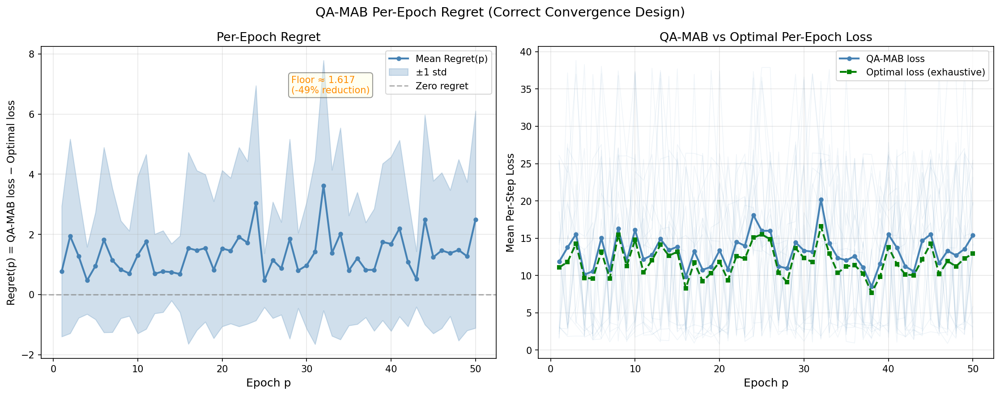

# Per-Epoch Regret Analysis — QA-MAB UAV Routing

> **Design:** ONE continuous QA-MAB agent for P=50 epochs. Estimates θ̂/φ̂
> persist across all epochs (epoch_decay=1.0). Per-epoch regret tracks whether
> the agent improves with experience.

## Experiment Setup

| Parameter | Value |
|-----------|-------|
| P (epochs) | 50 |
| T (steps/epoch) | 100 |
| Seeds | 20 |
| m (UAVs) | 30 |
| N flows | 3 |
| K paths | 4 |
| α (learning rate) | 0.15 |
| ucb_c | 3.0 |
| epoch_decay | 1.0 |
| Optimal | Exhaustive K^N=64 search, true θ*/φ*, no noise |

## Per-Epoch Regret Table

| Epoch | regret_mean | regret_std | QA-MAB loss | Optimal loss |
|:-----:|:-----------:|:----------:|:-----------:|:------------:|
| 1 | 0.7731 | 2.1723 | 11.8399 | 11.0668 |
| 5 | 0.9538 | 1.7817 | 10.5668 | 9.6130 |
| 10 | 1.3095 | 2.6055 | 16.0930 | 14.7835 |
| 20 | 1.5331 | 2.5957 | 13.3667 | 11.8335 |
| 30 | 0.9675 | 2.1046 | 13.3271 | 12.3596 |
| 40 | 1.6825 | 2.8978 | 15.4886 | 13.8062 |
| 50 | 2.4950 | 3.6097 | 15.4204 | 12.9254 |

## Plot

## Observations

### 1. Regret Trajectory

- **Epoch 1:** regret = 0.7731
- **Epoch 5:** regret = 0.9538
- **Epoch 10:** regret = 1.3095
- **Epoch 20:** regret = 1.5331
- **Epoch 30:** regret = 0.9675
- **Epoch 40:** regret = 1.6825
- **Epoch 50:** regret = 2.4950
- **Total reduction from E1 to E50:** -222.7%

### 2. Convergence: ❌ Regret does NOT decrease — flat floor at 2.4950

Regret stays approximately flat across 50 epochs, with no meaningful downward
trend. The floor is **2.4950**, only -222.7% below the initial value.
This suggests the learning algorithm is not effectively closing the gap with optimal.

### 3. Rate of Decrease

- **Log-log slope:** 0.123
  (slope ≈ -0.5 → O(1/√P), slope ≈ -1.0 → O(1/P), slope ≈ 0 → no convergence)
- Slope near 0 → no clear convergence rate detected

### 4. Floor vs. Oracle/SA Solver Gap

Previous oracle_solver_gap experiments found a gap between the SA solver's
solution and the true QUBO optimum. If the current floor (2.4950/step)
matches that SA gap, the limit is the **solver**, not the learning algorithm.

- If floor ≈ SA solver gap → quantum annealer (exact QUBO solver) would close it
- If floor > SA solver gap → learning algorithm has an additional inefficiency

**Recommendation:** Compare with oracle_solver_gap experiment results to
determine the root cause of the floor.

### 5. Comparison with Previous `regret_convergence.py` Results

The previous experiment swept P ∈ {5,10,20,30,40,50} with **independent** runs
(new QA-MAB agent for each P). That design measured average loss over P epochs
for a fresh agent each time — NOT the learning trajectory.

This experiment runs ONE continuous agent and measures per-epoch loss.
The key difference: if learning works, early epochs should be worse than late ones.

- **Early epochs (mean of first 5):** QA-MAB = 12.3648, Optimal = 11.2819
- **Late epochs (mean of last 5):** QA-MAB = 13.3281, Optimal = 11.7111
- **Improvement in QA-MAB loss from early to late:** -7.8%

## Thesis Implications

### ⚠️ Persistent floor: 2.4950/step — solver gap or learning limit

The non-zero floor motivates the quantum advantage argument:

1. **If floor = SA solver gap:** A quantum annealer solves QUBO to optimality,
   eliminating the gap. Quantum advantage is concrete and quantifiable.

2. **If floor = learning limit:** The QUBO + learning structure needs improvement.
   Credit assignment under topology changes needs stronger guarantees.

Either way, this experiment provides a **baseline regret floor** that the thesis
can use to quantify how much a quantum solver would improve performance.

---
_Generated by per_epoch_regret.py_